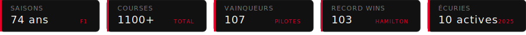
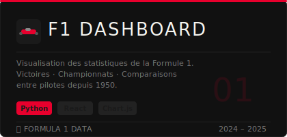

<p align="center">
  
</p>

<br/>

<p align="center">
  
</p>

<br/>

## 🏎 À propos du projet

<p align="left">
  
</p>

Bienvenue sur **F1 Analytics** — une application de visualisation des données historiques de la Formule 1.  
Victoires, championnats, comparaisons de pilotes depuis 1950.

---

## 🚀 Stack technique


---

## 📊 Fonctionnalités

- **Dashboard interactif** — victoires par pilote, par écurie, par saison
- **Comparateur** — analyse côte à côte entre deux pilotes
- **Timeline** — évolution des championnats depuis 1950
- **Filtres** — par ère, par écurie, par nationalité

---

## ⚡ Installation

```bash
git clone https://github.com/ton-username/f1-analytics.git
cd f1-analytics
pip install -r requirements.txt
npm install && npm run dev
```

---

<p align="center">
  <sub>Made with ❤️ · Données F1 depuis 1950 · 
  <a href="#">Documentation</a> · 
  <a href="#">Contribuer</a>
  </sub>
</p>
